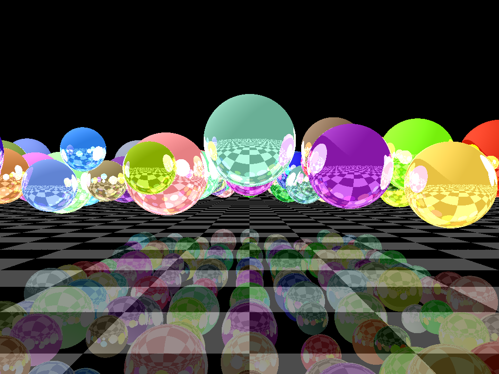

# Lanceur de rayon

L'objectif de ce hackathon est de vous initier à l'ingénierie d'un logiciel avancé. Dans votre carrière de Tech-Lead/CTO, on vous demandera de concevoir et de développer des logiciels qui vont au-delà d'un simple site web ou d'une application web avec une base de données et des appels API.

En tant qu'ingénieur logiciel, on vous demandera souvent de modéliser un principe scientifique, un principe mathématique, d'émuler des comportements basés sur la physique. Tout cela dans le but de créer un outil utile pour vos clients. Cette tâche peut souvent s'avérer décourageante :

* vous devrez apprendre, comprendre les concepts mathématiques, physiques ou autres concepts techniques qui sont en dehors de votre zone de confort
* vous devrez traduire ces concepts dans votre domaine : structures de données, algorithmes, architecture, ....
* vous devrez surmonter les problèmes de performance
* vous devrez fournir un produit qui soit réellement _utile_ à votre client

Pour ce projet, nous vous jetons dans le grand bain et vous demandons de concevoir un logiciel mathématique complexe ! Ce n'est pas parce que nous sommes sadiques, il y a en fait un certain nombre de compétences vraiment importantes et utiles qui devraient résulter de cet exercice :

* la capacité à traduire un principe mathématique en un problème d'ingénierie
* Choisir et mettre en œuvre de bonnes structures de données, des modèles de conception, et adopter une architecture propre.
* l'ajout d'un langage de programmation à votre boîte à outils (si vous ne connaissez pas déjà le C++)
* Être confronté à de sérieux problèmes d'optimisation et essayer de trouver des solutions.
* Vous efforcer de créer une expérience utilisateur agréable.

Il s'agit d'un projet de groupe, et par conséquent, en tant que futur Tech-Lead/CTO, vous devrez également pratiquer et affiner vos compétences non techniques, mais néanmoins essentielles :

* travailler et coordonner avec d'autres développeurs (planification, délégation, synchronisation, résolution de conflits, ...). Vous êtes libre d'utiliser la philosophie de gestion de projet que vous souhaitez (Agile, Scrum, Kanban, ...).
* travailler avec un dépôt GIT centralisé
* révision du code entre collègues

## Le projet : un "ray-tracer"

Nous sommes en 2035. L'IA et le Chat-GPT ont détruit le marché des compétences techniques. Une génération entière de développeurs « copier-coller » a donné naissance à une multitude de versions de logiciels défectueux. Les géants du rendu d'images par ordinateur sont à genoux. Adobe et Autodesk ont fait faillite. Blender est devenu inutilisable.

Les principaux studios de cinéma 3D en images de synthèse sont désespérés - ils ont besoin de leurs logiciels pour produire leur prochain film et n'ont nulle part où aller ! Heureusement, vous êtes là pour sauver la situation !

Votre mission est de créer, à partir des premiers principes, un **traceur de rayons**: un logiciel qui rend des images 3D en simulant la façon dont la lumière rebondit autour d'une scène.

<figure><figcaption>
Exemple d'une scène rendue par un raytracer basique avec 4 niveaux de réflexion. Il y a de la place pour l'amélioration !
</figcaption></figure>

Vous disposez d'une semaine pour réaliser ce logiciel. Les studios de cinéma exigent les fonctionnalités suivantes :

* Rendre au moins une **sphère** et un **plan** avec une réflexion complète (c'est-à-dire une sphère totalement métallique qui reflète son environnement), et produire une image unique au format PNG.
* Vous devez être capable de rendre une image haute résolution d'une scène avec une grande quantité d'objets, et au moins 4 rebonds de lumière. Vous devez mesurer le temps de rendu et l'indiquer dans votre soumission finale. N'oubliez pas qu'un film est composé d'une série d'images statiques. Votre logiciel devra donc rendre des centaines de milliers d'images pour créer le film. La vitesse de rendu est donc un facteur important pour le client !
* Si vous y parvenez, vous obtiendrez un crédit supplémentaire pour l'un ou l'autre des éléments suivants :
  * La mise en œuvre d'autres modèles de surface (Blinn, Phong, Gourad, Cook-Torrance).
  * Rendre d'autres formes, par exemple des cubes, des cylindres, des triangles
  * Le rendu d'un modèle 3D (au format .obj, .fbx, .collada ou autre)
  * Stratégies d'optimisation du rendu :
    * partitionnement de l'espace
    * Multi-threading ou traitement parallèle
    * Utilisation du GPU
    * Multi-traitement (rendu sur un cluster, files d'attente, etc.)
  * Techniques de rendu de surface plus avancées : texture-mapping, bump-mapping, environment mapping, ...
  * Un langage structuré de modélisation de la scène (un fichier d'entrée ?) spécifiant la disposition de la scène
  * Anti-crénelage
  * ...

Cependant, dans ce futur dystopique, il y a quelques contraintes ! Tous les langages de programmation modernes tels que Go, Python, Java, etc. sont devenus totalement propriétaires - pour les utiliser, vous devez payer d'énormes royalties, ce qui rendra ce projet irréalisable. Vous devez utiliser le seul langage libre restant : C++.

Heureusement, il y a quelques vieux sages qui peuvent transmettre des connaissances presque perdues sur ces logiciels fantastiques, qui ont été compilées dans ce guide. Lisez attentivement ces informations !

* [Qu'est-ce qu'un lanceur de rayons ?](raytracer/intro.md)
* [Débuter avec C++](cpp/intro.md)

## Travail d'équipe

Vous devez travailler en groupe de maximum 4 personnes. Merci de renseigner la constitution de vos groupes ici : [https://docs.google.com/spreadsheets/d/15XxlY-hAXphluYYi91rkFycaz-DHESSliPAoS5DUFLo/edit?usp=sharing](https://docs.google.com/spreadsheets/d/15XxlY-hAXphluYYi91rkFycaz-DHESSliPAoS5DUFLo/edit?usp=sharing)

## Notation

On vous a demandé de **construire un traceur de rayons à partir des premiers principes**, en utilisant le langage de programmation C++.


Le but de ce projet est de développer vos compétences d'ingénieur, votre capacité à concevoir et à exécuter un développement logiciel complexe. Les éléments suivants sont donc considérés comme contraires à l'esprit de l'exercice, et ne seront pas autorisés ou acceptés :

* La copie ou l'adaptation, de quelque manière que ce soit, des dépôts de traceurs de rayons existants sur Git-Hub ou ailleurs.
* L'utilisation de Chat-GPT, ou d'une autre intelligence artificielle, pour écrire votre code.

Je vous demanderai fréquemment d'expliquer votre code, et vous serez pénalisé si vous ne pouvez pas expliquer suffisamment votre structure de données ou vos algorithmes.


**Livraison et livrables**

Vous devrez présenter votre logiciel le jeudi 31 octobre 2024. Vous devrez présenter les éléments suivants :

* la ou les images rendues par votre logiciel
* le temps total de rendu de votre (vos) image(s)
* il vous sera demandé de réaliser un rendu d'image en direct devant le client
* vous devrez présenter et expliquer une partie de votre code
* vous devez fournir un lien vers le projet GitHub

**Notation**

La notation est réalisée _à la carte_. Un produit de base fonctionnel (MVP) vous vaudra une note qui passe. Ensuite, vous êtes libre de mettre en œuvre toutes les techniques que vous souhaitez pour améliorer votre note, jusqu'à un maximum de 20 points.

La grille de notation suivante sera utilisée pour évaluer le projet :

| Aspect                                                              | Note              |
| ------------------------------------------------------------------- | ----------------- |
| **Produit de base fonctionnel**\*                                   |                   |
| Un exécutable C++ fonctionnel                                       | 1                 |
| Une image PNG est produite                                          | 1                 |
| Au minimum, le rendu plat d'une sphère est réalisé                  | 1                 |
| Au minimum, le rendu diffus d'une sphère est réalisé                | 2                 |
| Rendu d'un plan                                                     | 1                 |
| Réflexions                                                          | 2                 |
| **Architecture C++ et qualité du code**                             |                   |
| Structures de données                                               | 1                 |
| Clean code                                                          | 1                 |
| Algorithmes utilisés et correctement expliqués                      | 1                 |
| **Points supplémentaires**                                          |                   |
| Les shaders de surface autres que les shaders diffus                | 3                 |
| Rendu d'autres formes                                               | 3                 |
| Rendu d'un modèle 3D (.obj, .fbx, ...)                              | 3                 |
| Stratégie d'optimisation                                            |  jusqu'à 8 points |
| Techniques avancées de rendu de surface                             | 3                 |
| Langage structuré de modélisation de la scène                       | 2                 |
| Toute autre caractéristique suffisamment expliquée et mise en œuvre | 3                 |
