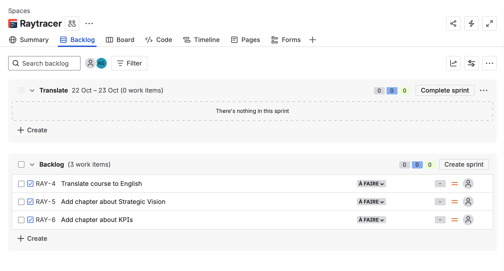
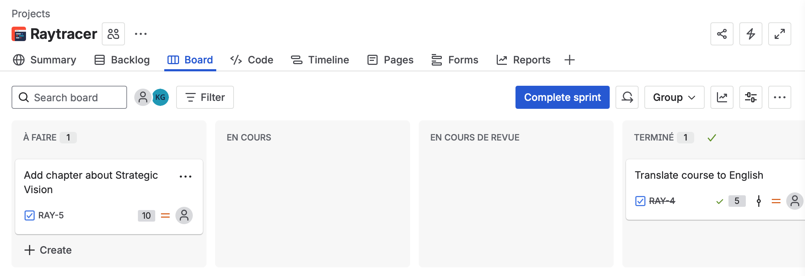
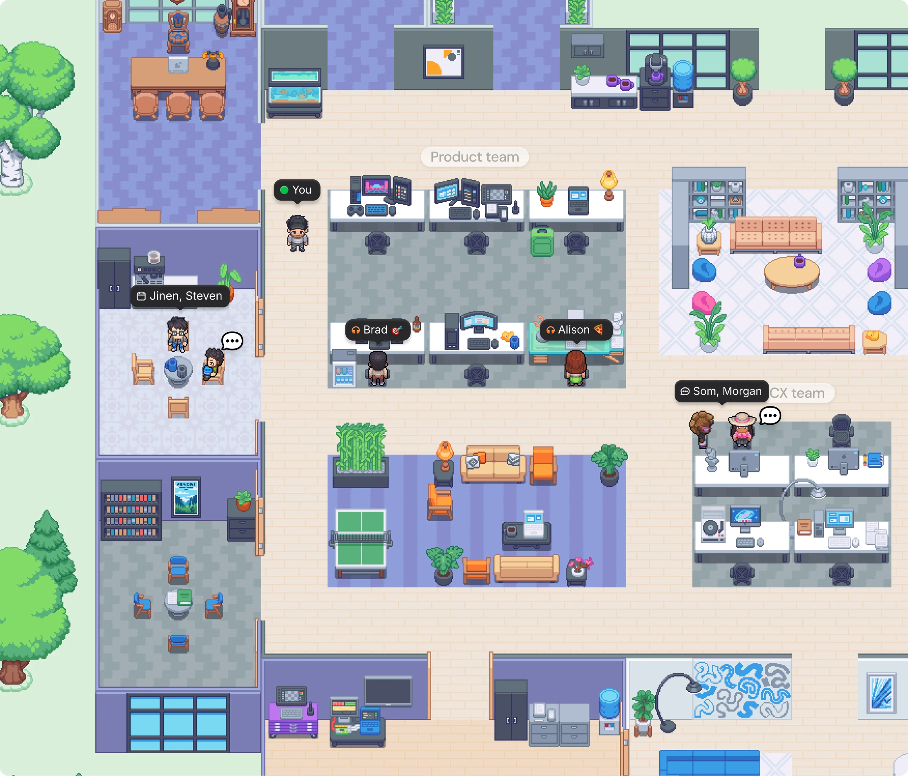

# Driving a technical project

You have defined your vision, your goals. Now you have to drive your project forward.

By now you have produced a number of different projects over your career and you should start having a feeling of how they should run.

## Introspection

Let us try and list together what went well and what did not work well in your last project.

(Class discussion & brainstorming)

## Driving a project

You have probably already had many courses about the Agile manifesto



**Individuals and interactions** over processes and tools
**Working software** over comprehensive documentation
**Customer collaboration** over contract negotiation
**Responding to change** over following a plan

That is, while there is value in the items on
the right, we value the items on the left more.



Remember to always put the above principles above any methodologies, otherwise the whole paradigm falls flat!

In any case, you have probably been taught the different methodologies, or ways of working, that aim to put into practice the Agile Manifesto. Some include SCRUM, Kanban, Expert-programming, and more.

All this remains very theoretical unless we try to actually put it into practice. Unfortunately in the context of a school project, the timings are greatly reduced, but it does not (and has not stopped) us from gaining valuable experiences with the processes and best practices.

## Tooling

For this project **it is obligatory to use industry standard tooling** for collaborating with your peers.

You will notably be required to use the following :

- GitHub : https://github.com
- Jira : https://www.atlassian.com/software/jira?

You will be required to push, to the maximum, your use of the Jira software package to manage your iterations and team communication.

The following is obligatory :
- The creation and maintenance of a backlog
- The creation and tracking of sprints (daily or bi-daily)
- If you wish, you may also investigate the notion of [Epics](https://www.atlassian.com/fr/agile/project-management/epics)
- Connection with your [Github and use Item Keys](https://support.atlassian.com/jira-cloud-administration/docs/use-the-github-for-jira-app/)
- The use of a Board for tracking progress 
- In Git, the proper management of branches
- If possible, the use of alerts and within your preferred communication tool (Slack, Discord, etc)

When working remotely, try using [Gather](https://www.gather.town/features) to see if it provides a better group cohesion !

## Managing uncertainty

You have probably noticed that it was quite difficult to plan your project due to the high degree of uncertainty involved.

Until now, you have probably gotten into the habit of planning your projects effectively, especially since the type of project you have been assigned is very familiar to you. For example, develop a web application with:
- a database
- an API
- a front-end

The distribution of tasks is fairly easy, as we have well-defined sub-modules (front, back, devops, etc.). In addition, you have already developed each of these modules as part of your course, you are familiar with the parameters, and you may have already begun to specialize in a particular area. Project management becomes easier!

But with the raytracer project, you suddenly find yourself in unfamiliar territory! There is a lot of uncertainty:
- Working with several teammates you may not know
- You are unsure of each person's level of expertise
- Little or no knowledge of the field
- Little or no knowledge of the programming language
- ...

How do you divide up the tasks when you don't even know what they are? Who do you assign them to when no one knows how they work?

## Analysis

A good project manager or technical manager knows how to identify areas in which they have little or no knowledge and includes them in their planning.

But how can you identify these gaps in your knowledge?

- Perform an **in-depth breakdown of the subtasks** required to achieve your goal. This may not be easy, but try to break down as many steps as your current knowledge allows. And repeat your analysis recursively as you acquire new knowledge.
- Conduct a survey within your team to determine who already has some of the required skills.

Let's take the example of our raytracer. The requirement was to *generate an image based on a raytracing algorithm using C++*.

There isn't much information to go on!

But we can already start breaking down the subtasks:
- We need to know C++
- Generate an image... how do we do that?
- We need to generate a PNG... how do we do that?
- Learn more about a raytracing algorithm

For now, the **raytracing** algorithm is still a big unknown, but the first two points seem manageable to start with.

## Plan for uncertainty

Regardless of the development philosophy and tools you use (Agile, Scrum, Kanban, etc.), it would be a good idea to include **exploratory tasks** in your planning, so that you can acquire the expertise needed to carry out the project.

Given the sub-tasks identified, we can already start creating tasks and distributing them to our teammates:
- Create a C++ “Hello World” application: set up the toolchain needed for our application.
- Research libraries for exporting a PNG image: do this in a parallel project just to acquire the knowledge.
- Research ray tracing

We have enough information for at least three members of our team to start working and probably get results within a few hours!

The member responsible for developing the C++ application will begin learning about the project structure, object orientation, the build process, etc.

The member responsible for researching ray tracing will undoubtedly start learning more about the necessary building blocks: vectors, rays, etc.

The member responsible for researching images will probably realize that they need a representation for colors.

At our next meeting, each member will be able to present the results of their work, and ideally the other members will also be able to acquire the knowledge they have gained. For example, everyone will now know how to start a basic C++ application and will probably begin to grasp the concept of object-oriented programming.

After consulting with the technical lead, we can confidently begin modeling our application. We have already identified some entities: Vector, Color, Image

We can start adding these elements to our backlog:
- Create a Vector3 class with all the basic operators (add, subtract, multiply).
- Create a Color class
- Create an Image class in which we can write colors and save them to disk.

There may be some overlap between the last two tasks. In this case, the first iteration of the person creating the Image class will simply write fake data to disk. This will be a “proof of concept” implementation that will most likely be abandoned. But once the Color class is ready, we can refine the Image class to use it for internal representation.


The key takeaway is that
**don't be afraid to add exploratory and research tasks to your backlog**.


## Uncertainty regarding your client

Even taking uncertainty into account, your client will most likely want to know exactly when their product will be ready.

(When I refer to a client, this could be your boss or an external client).

In my experience, there are two types of scenarios:

- **Projects for which we have the power to estimate development time and declare a delivery date**: This is the best scenario, but be careful, your client will not wait indefinitely! You still need to provide an estimate of the development time.

- **Projects with a fixed and unchangeable delivery date**: This situation occurs when your project corresponds to a specific, unchangeable event (such as New Year's Eve). This is the most difficult situation to manage, especially when there is uncertainty. It's difficult, but sometimes you have to turn down a project because you feel it is unfeasible!

### Flexible estimation

How do you calculate the delivery date when there is a high degree of uncertainty?

In my experience, try to give your team plenty of leeway for this uncertainty!

The only information you have is what you already know. You don't yet know what you don't know! Use this information to break down subtasks as much as possible. Wherever you identify the greatest knowledge gap, give yourself the most leeway to do research and develop proof of concept.

It is essential to maintain clear channels of communication with your client! It is quite possible that your client knows your field better than you do and can:
- provide you with training in the field
- point you to relevant resources
- introduce you to experienced people you can bring onto your team.

At a minimum, let your client know about the gaps in your knowledge and include intermediate milestones in your delivery schedule during which you will deliver the results of your research. This will keep them satisfied with the progress of the project.

If you encounter a problem, this approach will also allow you to keep the client informed and may make them more willing to adjust the delivery date.

### Fixed deadlines
Sometimes there are strict deadlines to meet—scheduled shows, festivals, etc. Publication dates that even the client has no control over.

In these situations, you need to be able to clearly assess whether the uncertainty is too great to guarantee on-time delivery. If the delivery date is far enough away, the project may still be feasible. But if the date is very close, you may have to make some difficult choices.

In my experience, there are a few solutions:

- **Reduce the scope of the project**: explain to your client exactly where the uncertainty lies. You may be able to reduce the scope of the project to eliminate as much uncertainty as possible.
- **Turn down the project**: clearly explain to your client why the uncertainty prevents you from meeting the delivery date.

In any case, **communication is essential**. Even if you have no choice but to accept the project, make it very clear that there could be serious risks to the feasibility of the project. **And make sure you have specified these risks in writing!**

## Iterative knowledge gathering

As mentioned above, start with what you know and try to improve your knowledge as you progress through the project.

You must continuously update your backlog, share your knowledge with your teammates, and inform your clients of the results of your proof of concept and research.



TLDR ;

Recursive knowledge gathering and planning:
- Analyze/plan as much as your knowledge allows
- Add exploratory tasks to your order book (search for proof of concept)
- Share information with your teammates
- Keep communication open with your customers

