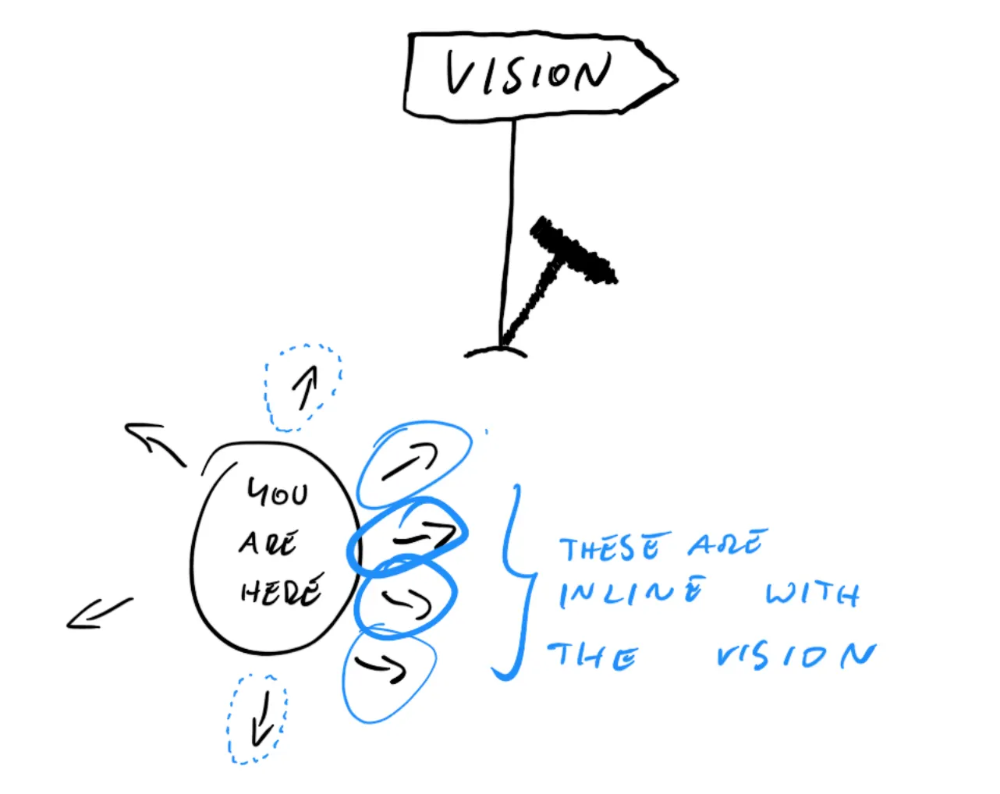
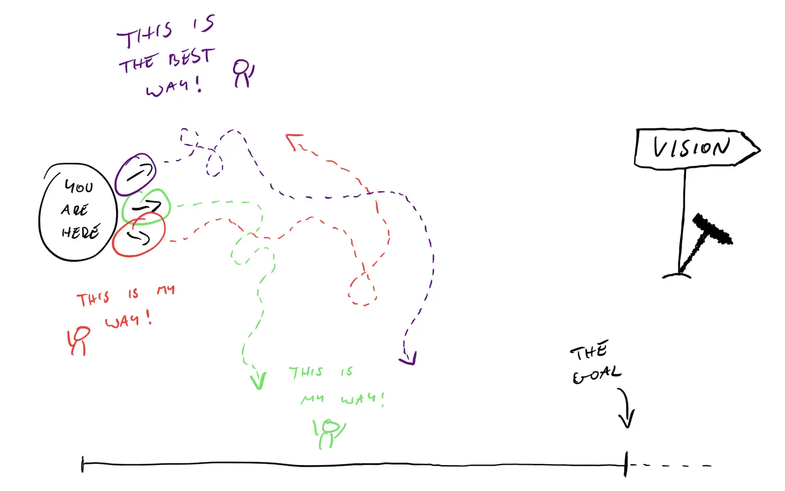
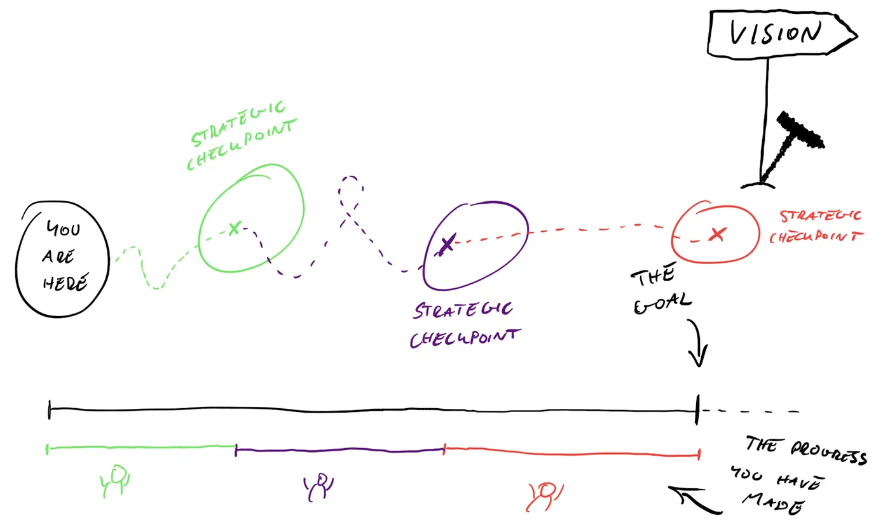

# Strategic Vision and Innovation

In any project you undertake, whether it is a short project for school (like this one), a long term project for work, or starting a business, or a home-renovation project, it is always a good idea to have an idea in your mind about WHY you are doing it ("Start with Why: How Great Leaders Inspire Everyone to Take Action" - Simon Sinek, 2009).

Imagine you were going on a road-trip, but without a final destination in mind. Sure, you may see some incredible things along the way. But more likely you'll end up going round and round, through dirty industrial zones and unsightly terrain. Even if you didn't want to plan every second of your trip, you may at least set a final destination that will continuously pull you towards your goal. In setting your final destination, you have settled on the WHAT, but not the WHY !

How do you choose you destination, or in fact your route? Why are you going on this roadtrip in the first place? The answer to this question will help you decide where to go and what route to take. Your vision for this roadtrip could be :

* to see things off the beaten track
* to feel entirely relaxed
* to party like a crazy person
* to envelope myself in the culture

All perfectly valid visions for your trip. But can you see, you vision may have draw you in drastically different directions.

This fuzzy concept, this image in your mind about WHY you are doing what you are doing, is what I call the **vision**.

You will find it is not as easy as it seems to put into words !

## Vision

[A vision is a long-term, aspirational goal](https://www.linkedin.com/pulse/how-define-engineering-mission-vision-strategy-fr%C3%A9d%C3%A9ric-cerdan/).

Generally, your vision is written in 1, maximum 2 sentences.

Print it out in large letters - make it your desktop background !

> By the way, I am going to shamelessly steal some very excellent illustrations and insights from [this article, "Why you need vision and strategy for your team", by Mirek Stanek](https://blog.practicalengineering.management/why-you-need-vision-and-strategy-for-your-team-e59951436f04). Go read it!

The idea that every decision, every innovation, every strategy, is measured up to this vision. If it is out of line with the vision, then perhaps more work needs to be done.

Writing a vision is hard - you need to dig deep and figure out what you really want and what is really needed !

To help you write your vision, you may fall back on first answering some of these questions :

* Who are your clients ?
* What are the real needs and pain points that you are trying to resolve ?
* What do you personally want to be doing ?

Go and answer these questions first, it may be clearer to you what your vision should be.

Now try and distill that feeling about WHY you are doing what you are doing into a single impactful statement.

* phrase it as a _higher purpose_
* make it _long term_
* make it general enough to inspire the _whole team_

Here is my vision for teaching :

> Have a lasting impact on all my students, where each one benefits, thinks back to, and is inspired by my courses for the rest of their careers.

Lets check if this is a valid vision :

* ✅ Has a higher purpose
* ✅ It is very long term
* ✅ General enough to communicate to the pedagogical staff, support staff or teaching aids

Your vision should then help you to write some **goals** to achieving that vision.

## Goals

Now that you have defined a vision, we need to set some goals that should bring us closer to our vision.

A goal is much more concrete and measurable. Since everyone may have there own interpretation of the vision, a goal is a much more concrete way of describing WHAT we need to achieve the vision.

Think of our roadtrip example. We know WHY we are going on this trip, but let us decide WHAT we are going to do. Here are some suggestions:

* Vision: to see things off the beaten track. Goal: A hiking or biking holiday
* Vision: to feel entirely relaxed. Goal: A spa holiday
* Vision: to party like a crazy person: Goal: A trip to Ibiza

Think of your family as a team. Each member of your family may have had their own interpretation of what it means to "see things off the beaten track". But by setting the goal of doing a hiking holiday, we bring into focus for everyone what how to achieve that vision. Now each stakeholder can more clearly set their own targets and strategies, and have something to measure :

* one person can research which bikes are the best and the equipment needed
* another can research the most interesting routes
* another can prepare a training schedule
* ...

We have a way of measuring up the actions of each towards reaching that goal, and whether we are heading towards our vision.

If suddenly a family member says, "I'm going to research the best party clubs", we can clearly see that is not aligned with our current vision, and we can take corrective action.

Here are some guidelines for settings goals:

* They should align with the vision
* They should be concrete
* They should be realistic
* They should be measurable

Let's take my vision for teaching. If I were to set some goals they would be as follows :

* conceive interesting and memorable projects
* have stimulating conversations and debates with my students
* provide sufficient documentation for future reference and self study

Now that we have goals defined, what we need is a **strategy**, that is, a way we can leverage our resources to achieve our goals.

## Strategy

Now that we have set our goals, how best to leverage our team to work towards our goals ?

Your strategy needs to take into consideration the resources at your disposal :

* the strengths and weaknesses of your team
* seniority
* experience
* time & availability

If you already know a bit about the Agile philosophy, you should start to be recognising some patterns here. Indeed, SCRUM methodologies such as story points and scrum poker is a way of getting your team to self identify their own strengths, and put into place short iterations that work towards the goal, with regular **checkpoints** (sprints and retrospectives).

For our vacation example, what would be considered a strategy ? Well, we know that we have a hard deadline for getting everything ready (summer vacation), so lets try leverage everyone's skills to get everything prepared for achieving our goal of going on a biking trip.

* Jane : already passionate about cycling and has contacts at a bike store. She agrees to try negotiate good prices for our equipment
* Sophie : generally very organised, she's in charge of making the reservations and trip planning
* Paul : fun-loving and endless joker, but not very organised and a little lazy. Let's get him to plan the "fun" side of the trips - fun outings, good food.

Paul may represent a weak point in our strategy, so we'll need some regular check-ins and maybe a backup plan, as we do not want to go on our trip without food!

We do not necessarily need a team to form a strategy. In the example of my teaching, I can also create a strategy for achieving my goals. For example, to conceive an interesting and memorable project :

* Draw from my own personal experience
* Make sure the project is challenging
* Give just enough information to get the project going, and then let the student guide themselves to a good solution
* Give regular and in-person feedback
* Make all the material is ready before the start of the course
* Continue monitoring the project to ensure it does not go off the rails

## KPIs

We talk about **measurable goals** and **checkpoints**, but how do you measure your progress ?

When setting a goal try and frame it in a way that we can evaluate whether it is achieved, or our progress towards it. These are called KPIs (or Key Performance Indicators).

For our goal of going on a biking holiday, the overall KPI is whether or not we end up going on the holiday or not ! But we can also measure our progress towards it :

* is the equipment ready ?
* do we have a planned route ?
* have the reservations been made ?
* have the menus been finalised and have we bought the food ?

For my goals as a teacher, obviously the school has its own KPIs such as :

* level of satisfaction after a course (questionnaire, post-course)
* student feedback
* rating of the course material, or the teacher
* pass rate

These are interesting, but I find have some personal KPIs that can also be very enlightening about whether I am achieving my goals :

* students stay behind after a course to chat
* students contact me after the end of their course (months, if not years after)
* observed dedication to the project (students are punctual, and stay to the end of the day)
* in person comments or written personal messages

## Innovation

One should not confuse Vision, Goals and Strategy with innovation. A business can have a vision without being innovative.

A baker, for example, could have a vision of "providing the highest quality and most recommended bakery in his town". This does not specifically require innovation, but a set of goals and strategies dedicated to quality and excellence.

But sometimes, innovation is a crucial element to a strategy in order to differentiate you and your team from competitors. If the town has 3 other very good bakers (lucky town!), perhaps the baker would need to invent new types of pastry or bread to attract customers. He could set innovative goals such as :

* produce a different type of bread every week
* add 4 items to the current pastry catalogue

These innovations may prove successful, and draw you closer to your vision. Or they may totally fail. That's the risk of innovation !

If you find my example a little silly, go read the [history of the cronut](https://www.marieclaire.fr/,le-cronut-un-dessert-made-in-france-cree-le-buzz-a-new-york,20119,694197.asp)

[So why innovate ?](https://www.appvizer.fr/magazine/marketing/intelligence-eco/strategie-innovation)

* changing trends
* be more versatile and appeal to different markets
* growing number of competitors
* changing user needs and habits
* financial pressure
* social pressure

Can you think of some examples of innovations that have resulted from the above reasons ?

We generally think of Silicon Valley and the great Unicorns that explode onto the scene with worldwide success (think AI). But this is not the only (and most risky) way of incorporating innovation into your goals and strategy.

* **incremental innovation** : small innovations with many iterations, continuously adapting to the feedback and needs of your clients
* **fundamental research** : perhaps you are in a completely new domain, and bringing a new technology to market (Quantum Computers)
* **radical innovation** : some try to anticipate or create new needs that we didn't know we had. Apple and Google are excellent examples of this.
* **disruption** : turn an existing market on its head, often by skirting around accepted norms (and sometimes laws!). Doctolib is a great example of this, as is AirBnB and Uber.

In all the above cases, one aspect is common : **understanding your client, and understanding their needs and pain-points**.

The first step, then, is to succinctly describe a problem, and then put into place a vision, goals and strategies towards resolving that problem.


Too often in the entrepreneurial space, I see the "radical innovation" syndrome, where someone comes up with a solution, without having identified the problem. It is very rare indeed that we can **create a need**.

But how does Google do it ? Well, remember, they started out by identifying a real need back in the early days of the internet. How to find information across the web. This was a very sticky problem and made life very difficult (you are probably too you to remember Yahoo! and its index pages by category). They were so successful in solving this problem, that they now have enough resources to invest in trying our new technology and absorbing the loss if it doesn't work. Resources your average startupper definitely does not have.


The rest of the innovative process is actually rather boring :

* researching and understanding your clients and the ecosystem
* identifying and following the competition
* having a good idea of your current and required resources
* fundraising
* leveraging your resources to innovate (brainstorming, execution, goals, ....)
* piloting your project (goals, strategies, KPIs)

## Exercise for evaluation

This course includes a sub-evaluation for the theme "Strategic Vision and Innovation", which will be evaluated in 2 parts:

* Friday 31 November 2025 : An informal group meeting, where you summarise to my your Vision, Goals, Strategy and KPIs. The deliverable of this meeting is a 1 page PDF containing :
  * Your group name and number
  * The name and surname of your team members
  * A short description of the client, his needs, and his pain-points (issues) - "problématique"
  * Your Vision Statement
  * Your Goals
  * Your KPIs
  * The mention "Hetic Master CTO & Tech Lead 2026"
* Tuesday 2 December 2025 : A technical poster detailing your innovation (your produced raytracer). This is a one page, scalable document that can be printed in large format, that advertises your achievement and innovation. It should include :
  * Your group name and number
  * The name and surname of your team members
  * The mention "Hetic Master CTO & Tech Lead 2026"
  * The problem statement and product developed
  * Schema of your developed architecture, workflows or other technical data
  * Screen shots of the working product and/or its output
  * It should be attractive, easy and quick to read and understand all while promoting your skills and innovations.

Here is an example poster, for which I won a prize at an academic conference many years ago (this was MANY years before the arrival of LLMs, but I wasn't too far off topic !) :

**Evaluation :**

Each deliverable will be evaluated out of 20. Evaluation is subjective, and depends on the clarity and coherence, with which you present your Vision, Goals, Strategy and KPIs. Re-read this page for a better understanding on how to formulate a strategy and goals - you may find some criteria hidden in the descriptions ! Primarily the evaluation is based in two parts :

* Does your document contain all the necessary information described just above ?
* Does your document convey all the principles discussed in the above discussion ?
