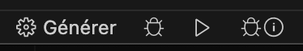

# Un projet simple

Il s'agit d'un petit guide pour vous aider à démarrer votre premier projet C++. Un exemple de projet est disponible à [https://dev.glassworks.tech:18081/courses/raytracer/raytracer-sample](https://dev.glassworks.tech:18081/courses/raytracer/raytracer-sample).

Vous êtes libre d'utiliser l'environnement logiciel de votre choix, mais ce guide vous aidera à utiliser Visual Studio Code.

## Extension VS Code

Visual Studio Code a un excellent support pour C++, vous pouvez [suivre ce guide](https://code.visualstudio.com/docs/languages/cpp) pour installer l'extension.

Vous devrez installer un compilateur C++ (s'il n'est pas déjà présent) pour votre système d'exploitation :

* [gcc sur windows](https://code.visualstudio.com/docs/cpp/config-mingw)
* [cmake sur macos](https://code.visualstudio.com/docs/cpp/config-clang-mac)

En général, il existe d'excellents tutoriels pour débuter avec C++ [sur ce site web](https://code.visualstudio.com/docs/cpp/introvideos-cpp)

## Un programme « hello world

Le petit exemple provient des guides VSCode.

* [CMake pour linux](https://code.visualstudio.com/docs/cpp/cmake-linux#\_build-hello-world)
* [Cmake](https://code.visualstudio.com/docs/cpp/cmake-quickstart)

Nous voulons juste créer un simple exécutable qui imprime un message sur la console. Créez le fichier `main.cpp` :

```cpp
#include <iostream>
#include <vector>
#include <string>

using namespace std;

int main()
{
    vector<string> msg {"Hello", "C++", "World", "from", "VS Code", "and the C++ extension!"};    

    for (const string& word : msg)
    {
        cout << word << " ";
    }
    cout << endl;
}
```

Votre groupe peut avoir des développeurs qui utilisent plusieurs systèmes d'exploitation. Nous allons essayer de créer un système de compilation qui soit multiplateforme, en utilisant CMake.

Installez d'abord [CMake tools for VSCode](https://marketplace.visualstudio.com/items?itemName=ms-vscode.cmake-tools).

Une fois installé, ouvrez la Command Palette de VSCode (`cmd+maj+P` ou `F1`), tapez `CMake` et choisissez `CMake : Quick Start`. Répondez aux questions suivantes :

* entrez un nom de projet
* choisissez c++
* ne sélectionnez pas CTest ou CPack
* sélectionnez « Executable » (pas library)

Ceci créera le fichier `CMakeLists.txt` qui indique à CMake comment construire votre projet.

Pour utiliser une version moderne de C++, nous devons activer au moins la version 11 :

```txt
cmake_minimum_required(VERSION 3.5.0)
project(raytracer VERSION 0.1.0 LANGUAGES C CXX)

# !!! ajoutez ces 2 lignes !!!
set (CMAKE_CXX_STANDARD 11)
set(CMAKE_CXX_STANDARD_REQUIRED True)


# change main.cpp to the entry file of your project -the one that has "int main() {}"
add_executable(raytracer main.cpp)
```

Lancez à nouveau la palette de commandes (`F1`), tapez `CMake : Quick Start`, cela va continuer le processus, en vous demandant comment vous souhaitez compiler votre projet (créer un `preset`).

Sélectionnez `Add a preselection`, puis `Create from compilers`. Une liste de compilateurs disponibles sur votre machine vous sera présentée. Choisissez-en un.

Puis donnez un nom à votre présélection, comme `macos-clang`, ou quelque chose que vous pourrez réutiliser.

Vous verrez apparaître le fichier `CMakePresets.json`, contenant votre configuration.

Chaque membre de l'équipe peut avoir à ajouter son propre présent en fonction de son architecture.

Une fois configuré, vous verrez dans la barre du bas des options pour construire et exécuter votre application :



Alternativement, vous pouvez naviguer dans le répertoire `build` ou `out`, et taper :

```bash
make
```

Ceci générera votre exécutable dans le même répertoire. J'ai appelé le mien `raytracer`, pour pouvoir le lancer en utilisant :

```bash
./raytracer
```

Si vous exécutez votre projet, vous devriez voir la sortie dans le terminal :

```
Hello C++ World from VS Code and the C++ extension! 
```
