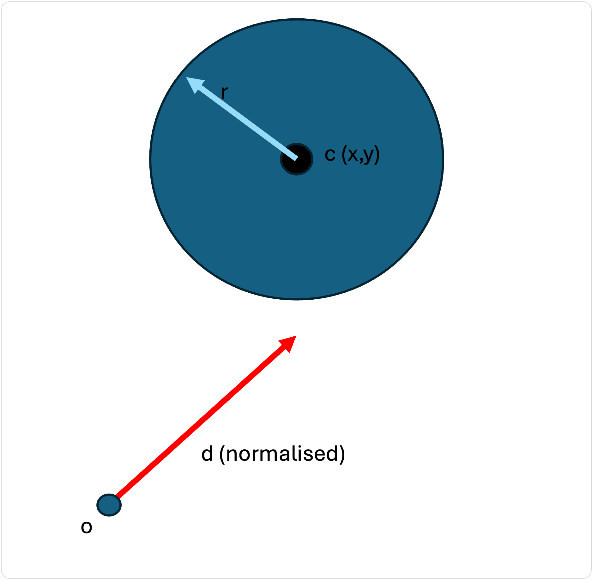
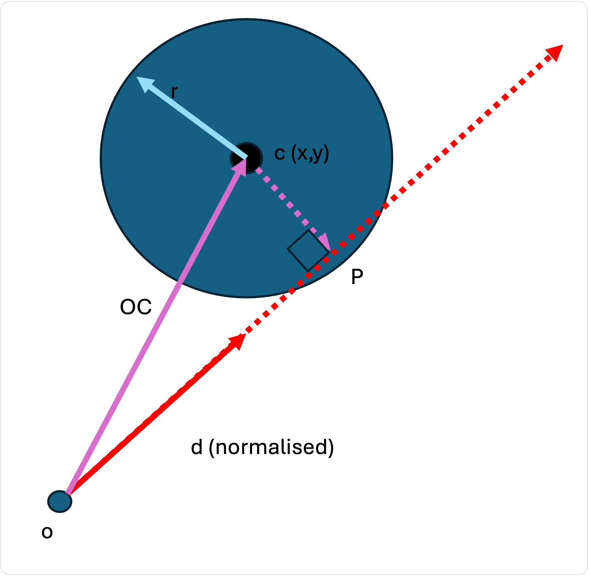
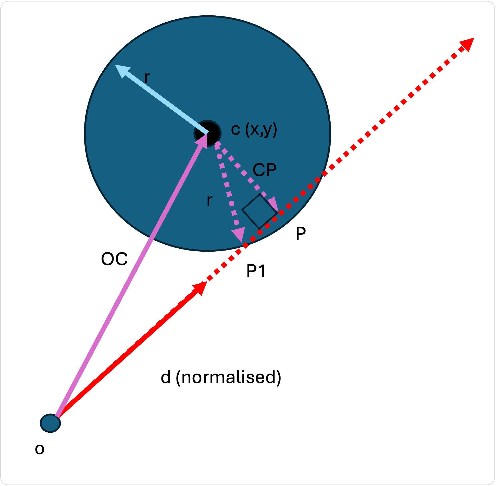
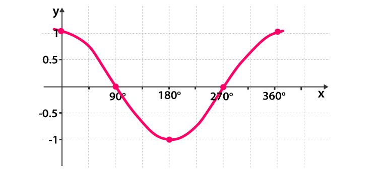
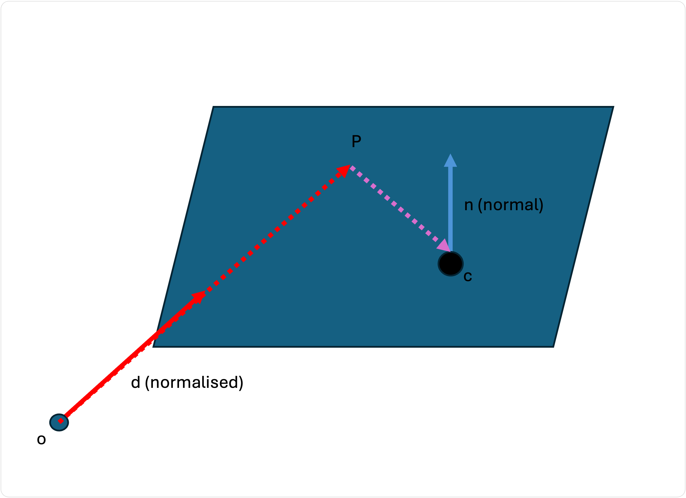

# Intersections

Nous disposons maintenant d'une construction mathématique pour représenter un rayon.

```
// Our ray
ray = {
  o: (0, 0, 0)
  d: (dx, dy, dz)
}
```

Le but de notre traceur de rayons est de calculer si ce rayon croise des objets dans notre monde virtuel 3D !

Comment effectuer ce calcul ?

## Intersection avec une sphère

La surface d'une sphère peut être définie de manière paramétrique comme un point dans l'espace (appelons-le `c` pour **centre**) et un rayon (`r`). La surface est le nombre infini de points situés à `r` unités du centre `c`.

Examinez la configuration suivante. Nous voulons savoir si le rayon rouge finira par croiser la sphère :



Comment pouvons-nous faire cela ?

Eh bien, il y a certaines choses que nous savons :

* Nous connaissons l'origine de notre rayon : `o`
* Nous connaissons le centre du cercle : `c`.

Connaissant ces deux positions, nous pouvons calculer un vecteur qui représente la distance à parcourir de `o` à `c` , en utilisant la soustraction :

```
oc = c - o
```



Si nous **projetons** `OC` sur notre rayon, nous obtenons le point `P` qui tombera quelque part le long du rayon (la partie en pointillé de la ligne représente la partie du rayon qui est au-delà de la première unité représentée par notre direction normalisée).

Heureusement, il est facile de projeter un vecteur sur un autre vecteur normalisé, en utilisant le **produit scalaire**. Imaginez que nous ayons un vecteur `d` et un autre `n`. Pour projeter le vecteur `d` sur le vecteur normalisé `n`, nous utilisons la formule :

$$
proj(d,n) = (\bar{d}\cdot\bar{n})\bar{n}
$$

The dot product is easy to calculate :

```
let d = (dx, dy, dz)
let n = (nx, ny, nz)

let dotproduct = (dx * nx) + (dy * ny) + (dz * nz)
```

Ainsi, dans notre exemple, la projection peut être calculée :

```
ray = {
  o: (0, 0, 0)
  d: (x, y, z)
}
sphere = {
  c: (cx, cy, cz)
  r: 5
}

oc = sphere.c - ray.o

// Calculate the dot product which is just a float
dotProd = (oc.x * ray.d.x) + (oc.y * ray.d.y) + (oc.z * ray.d.z);

// Multiply the dot product with the ray's direction vector
op = dotProd * ray.d = (dotProd * ray.d.x, dotProd * ray.d.y, dotProd * ray.d.z)

```

Ainsi, `op` est le vecteur qui nous emmène de `o` à `p`.

Pour calculer la valeur réelle de P, nous partons de l'origine de notre rayon, et nous ajoutons notre vecteur !

```
p = o + op
```

C'est très bien, mais en quoi le fait de connaître la position de `p` nous aide-t-il ? S'il se trouve à l'intérieur de la sphère, nous savons qu'il l'intersecte sans aucun doute. Comment savoir s'il est à l'intérieur de la sphère ? C'est simple ! Si la distance entre `c` et `p` est inférieure ou égale au rayon de la sphère !

Comment calculer la distance entre 2 points ? Eh bien, on calcule le déplacement nécessaire pour aller de l'un à l'autre (soustraction), et on calcule la longueur de ce vecteur (pythagore).

```
// Displacement vector from c to p
cp = p - c

// calculate the length of a vector using pythagorus !
let distance = length(cp) 

if (distance < r) { 
  // Intersects sphere!
} else {
  // No intersection
}
```

Génial ! Nous savons qu'il y a une intersection ! Comment trouver le point d'intersection exact `p1` ?



Nous connaissons déjà la longueur de `cp`, nous connaissons la valeur de `r`, et donc en utilisant pythagore nous pouvons calculer la longueur de `p -> p1` (appelons-le `a`).

```
let distance = length(cp) 
let a = sqrt( r*r - distance*distance )
```

Pour obtenir la position `P1`, il suffit de reculer de `a` unités le long de notre rayon initial, mais dans le sens inverse :

```
let p1 = p + (a * (-d))
```

Et voilà !

Maintenant que nous connaissons la position exacte de P dans le monde, nous pouvons commencer à déterminer la couleur de la surface en ce point !

Voici un résumé en pseudo-code des calculs nécessaires pour calculer le point d'intersection :

```
struct Vector3 {
  x: float
  y: float
  z: float
}

// calculate the length of a vector
function length(a: Vector3) {
  float l = Math.sqrt(a.x*a.x + a.y*a.y + a.z*a.z);
  return l
}

// normalise a vector (divide by its length)
function normalize(a: Vector3) {
  float l = length(a);
  return (a.x / l, a.y / l, a.z / l)
}

// calculate the dot product between two vectors
function dotProduct(a: Vector3, b: Vector3) {
  return (a.x * b*x) + (a*y + b*y) + (a.z * b.z)
}

let ray = { o: Vector3, d: Vector3(normalized) }
let sphere = { c: Vector3, r: float }

function intersectSphere(ray, sphere) {
  
  let OC = sphere.c - o      // OC is a vector

  let dotProd = dotProduct(OC, ray.d)   // dotProd is a float

  let OP = dotProd * ray.d      // OP is a vector

  let P = ray.o + OP            // P is a point

  let CP = P - sphere.c                // CP is a vector

  let lenCP = length(CP)        // lenCP is a float

  // No intersection if the distance from between P and C 
  // is greater than the radius of our sphere!
  if (lenCP > sphere.r) { return }   

  let a = Math.sqrt(r*r - lenCP*lenCP)    // a is a float

  let P1 = P + (a * -ray.d)               // P1 is a vector

  return P1
}
```


Voici quelques chiffres pour debugger votre implémentation.

Imaginons qu'on a une caméra à `(0,0,0)`, orientée vers l'axe z-negatif. 

Pour une sphère à `(0, 0, 6)` avec un rayon de `1` :

 - Un rayon passant à travers du point `(0, 0, 1)` touchera la sphère à `(0, 0, 5)`
 - Un rayon passant à travers du point `(0.01, 0, 1)`, aura la direction normalisée `(0.0099995,0,0.99995)` et touchera la sphère à `(0.0500125,0,5.00125)`

Pour une sphère à `(2, 0, 6)` avec un rayon de `1` :
 - Un rayon passant à travers du point `(0.5, 0.05, 1)`, aura la direction normalisée `(0.446767,0.0446767,0.893534)` et touchera la sphère à `(2.63852,0.263852,5.27704)`



## Note sur le produit scalaire

Le produit scalaire entre deux vecteurs est une valeur très intéressante et utile

### Relation spatiale

Si **les deux vecteurs sont normalisés**, le produit scalaire est égal au **cosinus** de l'angle entre les deux vecteurs.

$$
\bar{d}\cdot\bar{n}= \cos{\theta}
$$

Pourquoi est-ce utile ? Eh bien, sans avoir à calculer l'angle θ, nous pouvons déduire des choses sur la relation entre les deux vecteurs.



Le graphique montre que :

* si le produit scalaire = 1, alors nous sommes à 0°. Les deux directions sont orientées dans le même sens
* si le produit scalaire = 0, alors nous sommes à 90°. Les deux directions sont perpendiculaires.
* si le produit scalaire > 0, le graphique se situe quelque part entre 0° et 90°, il doit donc s'agir d'un angle aigu
* si le produit scalaire < 1, le graphique se situe quelque part entre 90° et 270°, il doit donc s'agir d'un angle obtus.

Dans l'exemple précédent, nous voulions savoir si la sphère se trouvait **devant le rayon** (et non derrière). L'angle entre notre rayon et la direction vers le centre de la sphère doit donc être un angle aigu. Nous calculons le produit scalaire entre ces deux directions (normalisées), et s'il est négatif, nous savons qu'il s'agit d'un angle obtus, et donc que la sphère doit être derrière nous !

```
// Normalise OC
ocnorm = normalise(oc)
// ray.d - should be already be normalised !

// If the dotproduct is negative, the angle between the two directions is
// greater than 90°, so the object must be behind the ray. Ignore the object!
if (dotproduct(ocnorm, d) < 0 ) { return }
```

### Angle

Nous pouvons bien sûr obtenir l'angle (en radians) entre les deux directions en utilisant l'inverse du cosinus :

$$
\theta = \arccos({\bar{d}\cdot\bar{n}})
$$

Cette méthode renvoie une valeur comprise entre 0 et 2π. Attention cependant, elle ne renvoie pas de nombres négatifs, de sorte que nous ne pouvons pas savoir si l'angle entre les deux vecteurs est à gauche ou à droite.


Comment convertir les radians en degrés ?&#x20;


$$
degrees = radians * 180/\pi
$$


### Projection

Le produit scalaire entre un vecteur non normalisé et un vecteur normalisé nous donne la longueur d'une projection du vecteur non normalisé sur le vecteur normalisé.

Qu'est-ce qu'une projection ?

En imaginant que vous projetiez une lumière perpendiculairement au vecteur normalisé. L'ombre de l'autre vecteur sur le vecteur normalisé est la projection !

Imaginez que nous ayons un vecteur `d` et un autre `n` (qui est normalisé). Pour projeter le vecteur `d` sur le vecteur `n`, nous utilisons la formule :

$$
proj(d,n) = (\bar{d}\cdot\bar{n})\bar{n}
$$

## Intersection avec un plan

Un plan infini peut être exprimé de façon paramétrique comme suit

* supposons que nous ayons un point `c` dans l'espace, et un vecteur normal `n`
* le plan est l'ensemble des points `p` où le vecteur `pc` est perpendiculaire à la normale `n`.



Dans le diagramme, nous supposons que `p` se trouve également sur notre rayon. Si la direction du rayon est normalisée, il nous suffit de trouver un multiplicateur `t` pour ce rayon qui le redimensionnera suffisamment pour nous amener à `p`

$$
\bar{p} = \bar{o} + t\bar{d}
$$

Nous ne savons pas encore ce qu'est `t` - nous devons le calculer !

Mais nous avons besoin de plus d'informations.

En regardant le diagramme, on peut aussi déduire que si `p` est sur le plan, alors la ligne `pc` doit être perpendiculaire à la normale `n`.

Heureusement, le produit scalaire est à nouveau notre ami ! En effet, si le produit scalaire entre deux vecteurs normalisés est 0, cela signifie que les deux vecteurs qui l'ont créé sont perpendiculaires !

$$
(\bar{p} - \bar{c})\cdot(\bar{n}) = 0
$$

Remplaçons `p` de notre rayon par la formule du plan :

$$
(\bar{o} + t\bar{d} - \bar{c})\cdot\bar{n} = 0
$$

Multipliez le produit scalaire :

$$
\bar{o}\cdot\bar{n} + t\bar{d}\cdot\bar{n} - \bar{c}\cdot\bar{n} = 0
$$

Résolvez pour `t` :

$$
t\bar{d}\cdot\bar{n} = \bar{c}\cdot\bar{n} -\bar{o}\cdot\bar{n}
$$

$$
t\bar{d}\cdot\bar{n} = (\bar{c} -\bar{o})\cdot\bar{n}
$$

$$
t = \frac{(\bar{c} -\bar{o})\cdot\bar{n}}{\bar{d}\cdot\bar{n}}
$$

Nous disposons donc d'une formule relativement simple pour calculer `t` !

Calculons d'abord le dénominateur :

```
let denom = dotProduct(ray.d, plane.n)

if (denom > -0.000001) {
  // The ray is parallel to the plane (denom == 0)
  // OR The angle between the the incoming ray and the normal is > 90°
  //    meaning the plane is behind us
  return
}
```

Si le dénominateur est nul ou proche de zéro, cela signifie que notre rayon est perpendiculaire à la normale, c'est-à-dire que le rayon est parallèle au plan et ne l'intersectera jamais !

Calculons ensuite le numérateur :

```
let num = dotProduct(plane.c - ray.o, plane.n)

let t = num / denom
```

Maintenant que nous avons `t`, nous pouvons calculer le point `p` en le substituant à la formule de notre rayon :

```
let p = ray.o + t * ray.d
```

All together :

```

let ray = { o: Vector3, d: Vector3(normalized) }
let plane = { c: Vector3, n: Vector3(normalized) }

function intersectPLane(ray, plane) {
  
  let denom = dotProduct(ray.d, plane.n)

  if (denom > -0.000001) {
    // The ray is parallel to the plane
    return
  }
  let num = dotProduct(plane.c - ray.o, plane.n)

  let t = num / denom

  let p = ray.o + t * ray.d

  return p

}
```
