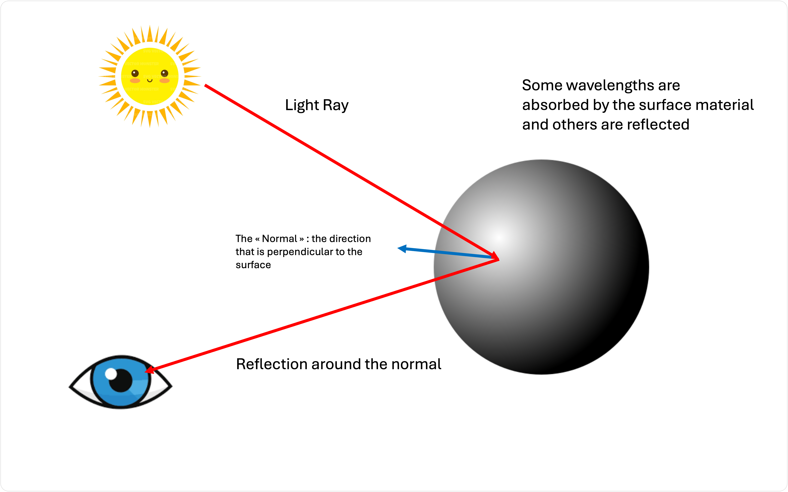
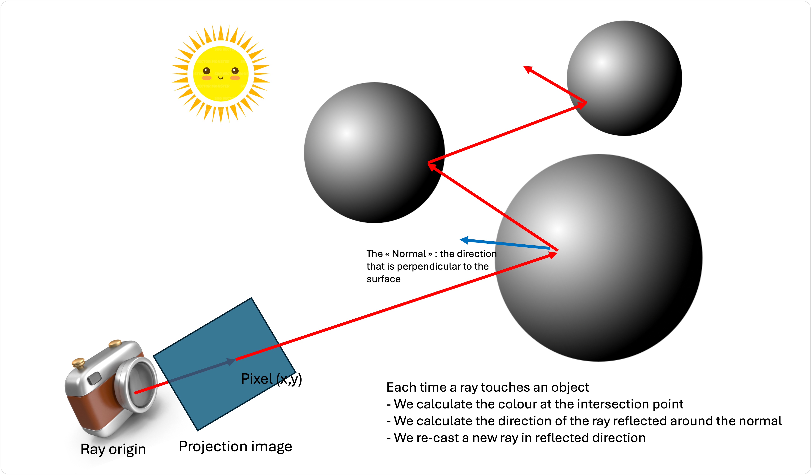
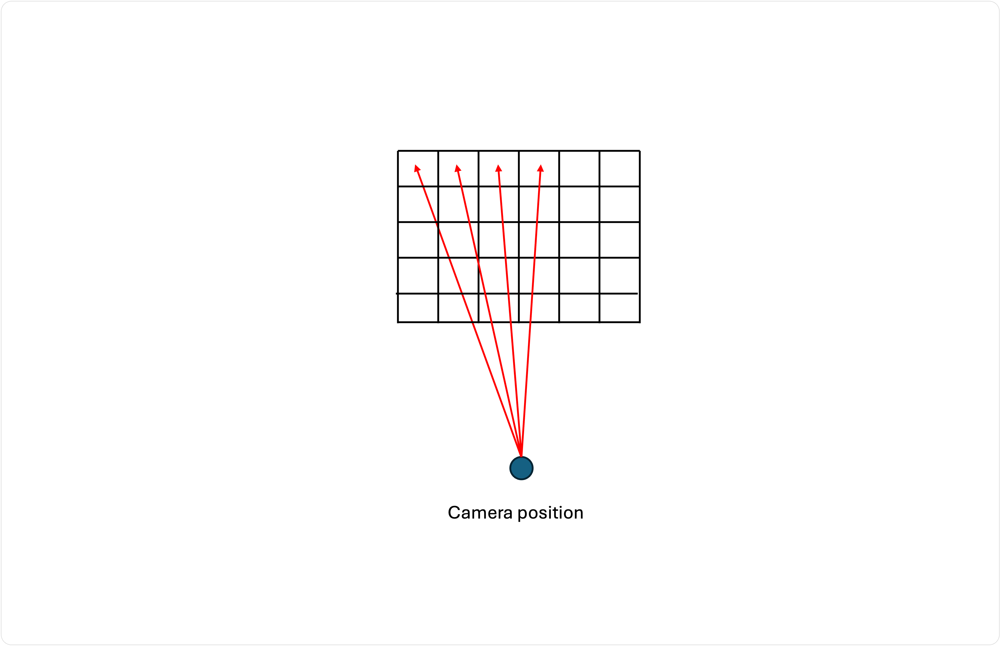

# Qu'est-ce qu'un raytracer ?

Dans le rendu photoréaliste, un *lanceur de rayons* vise à simuler la façon dont la lumière rebondit sur une scène virtuelle en trois dimensions.

L'objectif est de rendre une image aussi proche que possible de l'apparence du monde réel, d'où le terme « photoréaliste ».

Nous simulons la lumière - un phénomène physique qui implique des fréquences, des longueurs d'onde, des propriétés matérielles, etc. Vous découvrirez qu'essayer de simuler un phénomène naturel sur un ordinateur est un exercice difficile et souvent coûteux en termes de calcul (ce qui en fait une excellente expérience d'apprentissage dans le cadre de ce cours !)

Lorsque nous *modélisons* la physique de la vie réelle, pour réduire le problème à un niveau gérable, nous créons une version simplifiée pour commencer. C'est ce que nous allons faire pour les rayons lumineux !


## Un modèle de lumière simplifié

Simplifions la façon dont nous percevons les choses dans le monde réel, comme l'illustre l'image suivante :



Dans sa forme la plus simple, une lumière (ou le soleil) émet des rayons lumineux, qui peuvent être représentés par un **vecteur directionnel**, une ligne droite qui a une source et une direction.

Cette lumière voyage en ligne droite jusqu'à ce qu'elle atteigne un objet dans notre monde. Certaines des longueurs d'onde de la lumière (couleurs) seront absorbées par la surface de l'objet, en fonction de sa composition. Certaines surfaces, comme le bois, absorbent toutes les couleurs à l'exception des couleurs brunâtres. Une feuille de papier blanc n'absorbe pratiquement aucune couleur et les reflète toutes. 

Le rayon lumineux est réfléchi autour de la **normale à la surface** au point d'intersection avec l'objet. Une normale de surface est la direction **perpendiculaire** à la surface. Ce rayon lumineux réfléchi poursuit son chemin dans le monde.

Peut-être le rayon lumineux pénètre-t-il dans notre œil et se pose-t-il sur notre rétine. C'est ainsi que nous percevons les choses dans notre monde ! Sur la base de la lumière qui a rebondi autour du monde, les couleurs étant absorbées ou réfléchies en chemin, et par chance, entrant dans nos yeux.


## Un modèle inverse pour plus de simplicité

Il serait beaucoup trop coûteux de simuler chaque rayon lumineux émis par une source lumineuse dans une scène virtuelle, en espérant n'enregistrer que ceux qui atterrissent sur notre rétine virtuelle ! Nous devons simplifier le problème. 

Et si nous inversions le problème ? Ignorons toute la lumière qui n'entre jamais dans notre œil, et simulons seulement celle qui y entre. Nous réduisons drastiquement le nombre de rayons à calculer.

Mais comment savoir quels sont ceux qui, partant de la source lumineuse, finissent par arriver dans nos yeux ?

Eh bien, les rayons ne sont qu'une série de lignes droites qui rebondissent autour de leurs normales. Ce qui fonctionne dans une direction fonctionne aussi bien dans l'autre !

Commençons le rayon cette fois-ci dans notre œil, et envoyons-le dans la scène. Lorsque nous touchons un objet, nous pouvons déterminer la couleur de cet objet (au point d'intersection), calculer le nouveau rayon réfléchi et répéter le processus.

La couleur finale que voit notre œil virtuel sera simplement la couleur accumulée (c'est-à-dire l'addition des couleurs) par le chemin parcouru par notre rayon !




## Qu'est-ce qu'une couleur ?

En physique, une couleur est une lumière avec une certaine longueur d'onde. C'est un peu compliqué, et nous pouvons modéliser cette entité plus simplement.

Nos écrans d'ordinateur modernes nous donnent l'impression de voir des images, des photos et des films en émettant de la lumière à différentes longueurs d'onde. Si vous regardez de près un écran d'ordinateur, vous remarquerez qu'il s'agit d'un réseau serré d'émetteurs LED des trois longueurs d'onde de base : le rouge, le bleu et le vert (RVB). Ces trois longueurs d'onde permettent de produire un **gamut** de couleurs allant du presque noir (absence de lumière) au blanc (intensité maximale).

Chaque triplet de LED rouges, vertes et bleues représente un **pixel**. Si nous disposons horizontalement une rangée de 1920 pixels serrés, et que nous le faisons pour 1080 rangées, nous aurons un écran HD de 1920x1080 pixels, ou 1920x1080x3 LEDS !

Le RVB est devenu l'unité standard de représentation des couleurs dans les dispositifs émettant de la lumière, et c'est cette unité que nous utiliserons ici. 

Qu'est-ce qu'une couleur dans notre contexte ? C'est l'intensité du rouge, du vert et du bleu pour un seul pixel ! Il est facile de la représenter à l'aide d'un tuple tridimensionnel :

`(red, green, blue)`

Nous sommes libres de décider dans quelle gamme représenter chaque intensité (ou **profondeur de couleur**). Par exemple, si nous utilisons 1 octet (donc un minimum de zéro et un maximum de 255) pour représenter chaque intensité, nous pourrions avoir ce qui suit :

```
Red:   (255, 0, 0)
Green: (0, 255, 0)
Blue:  (0, 0, 255)
```

Nous pourrions également normaliser cette valeur et dire que nous représenterons chaque composant comme un point flottant entre 0 et 1 :


```
Red:   (1, 0, 0)
Green: (0, 1 0)
Blue:  (0, 0, 1)
```

L'avantage de cette représentation est que l'on peut facilement accumuler les couleurs par simple addition !

Qu'obtient-on en mélangeant du rouge et du vert (en lumière, pas en peinture !) ? Du jaune !


```
(1, 0, 0) + (0, 1, 0) = (1, 1, 0)
```

Il s'agit d'une simple addition vectorielle, qui consiste à ajouter chaque composante du premier vecteur à la composante correspondante du second vecteur.

Il y a cependant un problème. Nous ne pouvons jamais avoir une valeur supérieure au maximum. Par conséquent, si nous ajoutons du turquoise à notre jaune, nous obtiendrons simplement du blanc (et non une couleur étrange comme l'octarine) :


```
(1, 1, 0) + (0, 1, 1) = (1, 1, 1)   // and not (1, 2, 1)
```

## Qu'est-ce qu'une image ?

Notre objectif est de rendre une **image**, un plan bidimensionnel sur lequel la lumière du monde est projetée.

Nous savons que notre image est composée de **pixels** (par exemple, 1920x1808 pixels au total).

Une image n'est donc qu'un énorme tableau de tuples de couleurs.


```
[
  (0, 0, 1),
  (0, 0, 1),
  (1, 0, 1),
  (1, 1, 1),
]
```

L'exemple ci-dessus est une image 2x2 contenant 4 pixels.

Le but de notre raytracer est donc de calculer la bonne couleur pour chaque pixel, afin qu'il représente fidèlement une projection de la scène !

Une fois que nous avons ce tableau de valeurs RVB, il suffit de le sauvegarder dans un fichier (un bitmap, sans compression, ou un .png pour une compression sans perte)


## Un algorithme pour générer notre image

Le pseudo-code suivant peut être utilisé pour générer une image :


```ts

let width = 1920
let height = 1080
let pixels = Array(1920x1080)

// The position of the camera in the world
const cameraPosition = (0, 0, -1)
// The direction of the camera
const cameraDirection = (0, 0, 1)

for (let y = 0; y < height; ++y) {
  for (let x = 0; x < width; ++x) {
    
    // Initially the color of the pixel is black
    let color = (0, 0, 0);

    // Get the world ray starting at the camera position, and going through the current pixel
    let direction = getWorldRay(x, y);

    // Cast the ray into the world
    color = color + castRay(cameraPosition, direction)

    // Set the pixel in the image
    pixels[(y * width) + x] = color;
  }
}

```

Comment obtenir le **world ray**?

En fait, c'est assez facile, nous voulons simplement tirer un rayon depuis notre oeil à travers chaque pixel d'une image virtuelle devant notre oeil :




Facile, non ? Eh bien... vous aurez peut-être besoin d'un peu de mathématiques pour mettre en œuvre cet algorithme.

