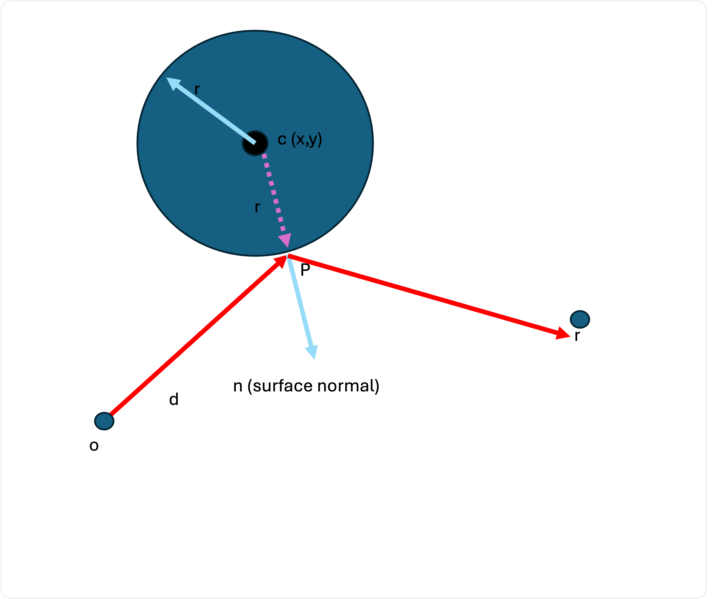
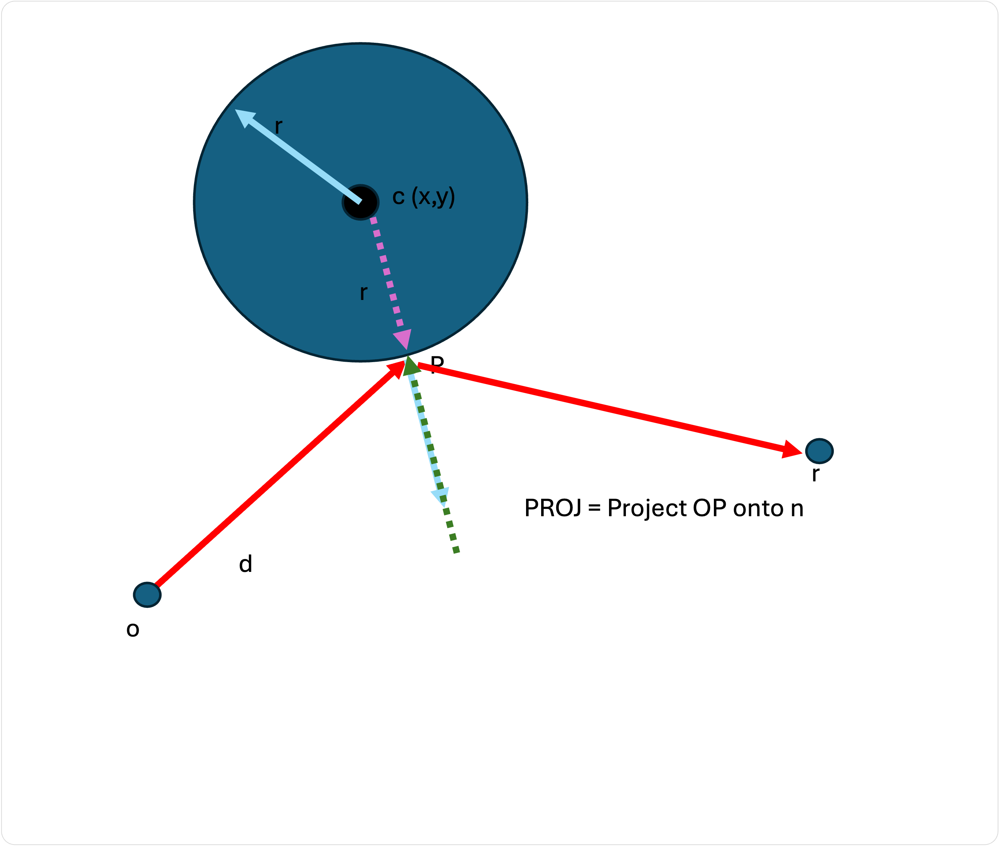
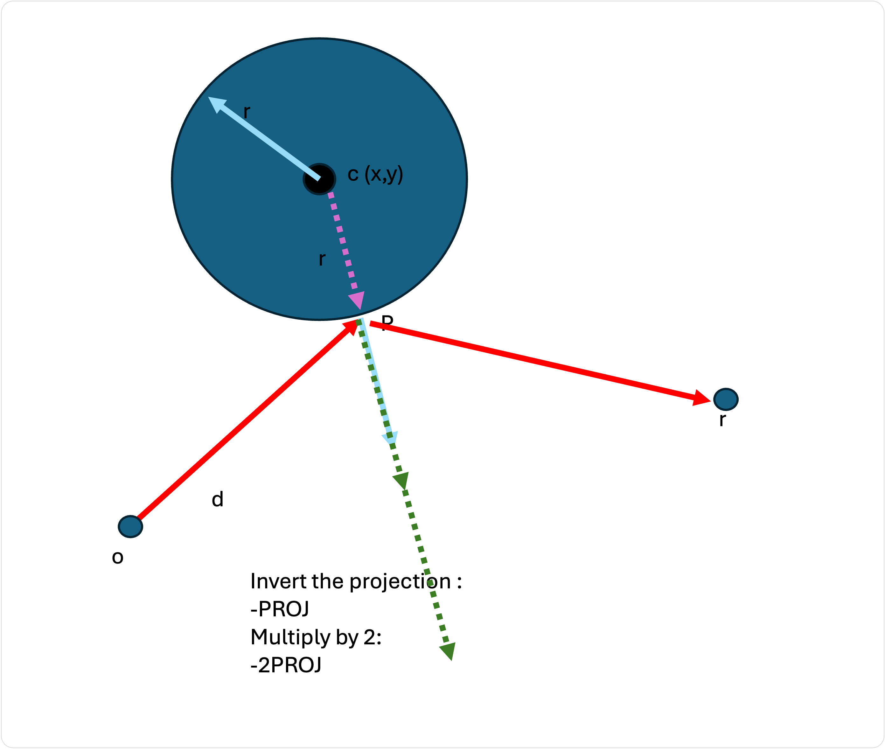
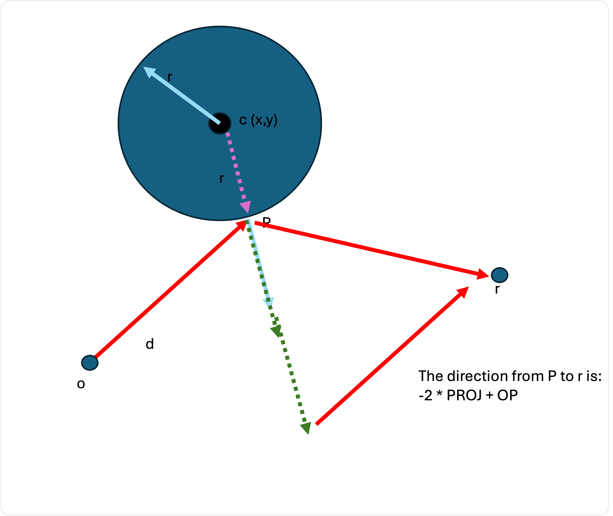

# Réflexions

Une fois que nous avons calculé la couleur en un point, nous pouvons vouloir accumuler les réflexions d'autres objets en ce point.

Pour ce faire, il faut lancer un rayon dans une direction autour de la normale.

```
pixel = pixel + castRay(P, reflectDirection)
```

Nous répétons le processus de diffusion des rayons et ajoutons la couleur renvoyée à la couleur actuelle. En réalité, nous appliquerions un multiplicateur pour atténuer la couleur de réflexion :


```
pixel = pixel + sphere.reflectFactor * castRay(P, reflectDirection)
```

Mais comment calculer la direction de la réflexion ?

Considérez l'image :



Nous devons calculer le vecteur `pr` qui est une réflexion de `op` autour de la normale `n`.

Comment faire ?

Projetons d'abord `Ppr` sur la normale : 




Inversons maintenant cette projection (en la multipliant par -1) et doublons-la :




Si nous ajoutons notre vecteur de direction original à notre projection, nous obtenons `r` !



En code, notre vecteur de réflexion est calculé comme suit :

```
let normal = normlize(P - sphere.c);

function reflectRay(ray, normal, P) {
  // project the ray direction onto the normal
  let proj = dotProduct(ray.d, normal) * normal

  // invert the projection and multiply by 2
  proj = -2 * proj

  let reflectDir = proj + ray.d  

  // The new ray has P as its starting point, and the reflectDir as its direction
  return new Ray(
    o = P
    d = reflectDir
  )
}

```