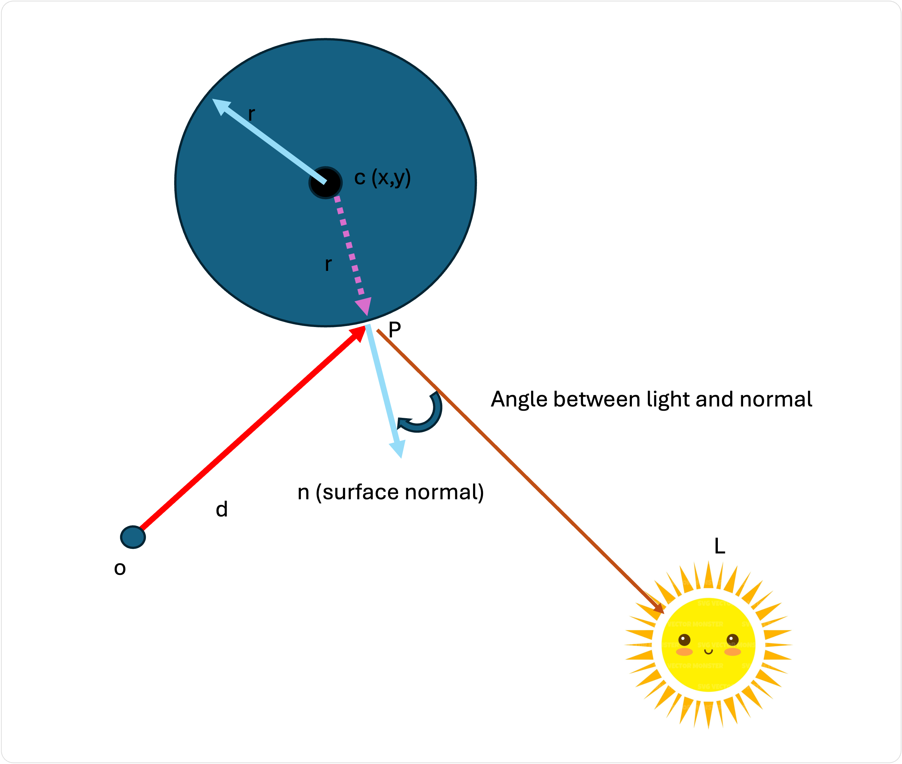

# Shading


Rappelez-vous que nous essayons de calculer la couleur d'un pixel.

Supposons que notre pixel commence par être noir :


```
let pixel = (0, 0, 0)
```

Si nous lançons un rayon et qu'il ne touche rien dans la scène, le pixel reste noir et nous passons au pixel suivant.

Cependant, si nous touchons un objet, nous pouvons donner au pixel la **couleur ambiante** de cet objet.

Supposons que nous croisions une sphère et que nous sachions que cette sphère est d'une teinte verte foncée :


```

let pixel = (0, 0, 0)
let ray = { o: Vector3, d: Vector3(normalized) }
let sphere = { c: Vector3, r: float, ambientColor: Color }

let P = intersectSphere(ray, sphere)

if (!P) { return }   // no intersection 

// Add the base color of the sphere
pixel = pixel + sphere.ambientColor

```

Implémentez cet algorithme dans votre code, vous aurez implémenté un **flat shader**!


Un **flat shader** ne donne aucun effet 3D de la surface. En réalité, c'est la lumière réfléchie par un objet qui lui donne sa profondeur dans le monde réel.



## Shader Diffus

C'est la lumière de notre scène qui donne à nos objets leur profondeur. Nous devons tenir compte de la lumière et de la forme à la surface de notre point d'intersection.



Dans l'image ci-dessus, nous avons déjà calculé que notre rayon coupe la sphère au point P. Nous voulons maintenant connaître la couleur de la sphère au point P.

Un modèle de shading simple consiste à dire que la couleur du point est relative à l'angle entre la lumière entrante et la normale au point.

Plus l'angle est petit, plus la lumière frappe directement la surface. Plus l'angle est grand, moins la lumière frappe directement la surface.

En regardant le diagramme, nous pouvons calculer la normale d'une sphère, qui est simplement le vecteur `cp`


```
let cp = p - sphere.c
```

The vector pointing to the light is just the position of the light subtracting the point:

```
let pl = l - p
```

Une fois de plus, le produit scalaire vient à notre secours ! Vous souvenez-vous que nous avons dit que si le produit du point entre deux vecteurs est 0, alors ils sont perpendiculaires ? Il s'ensuit que si le produit point est égal à 1, alors les deux vecteurs sont parallèles.

Nous pouvons donc utiliser le produit scalaire comme multiplicateur d'intensité ! Si l'angle avec la lumière est perpendiculaire, la valeur du produit scalaire est 0, et nous multiplions donc la couleur de notre objet par zéro (noir). Si l'angle avec la lumière est de 0 degré, la valeur du produit scalaire est de 1, et nous multiplions la couleur de notre objet par 1. 

```
let nCP = normalize(cp);
let nPL = normalize(pl);

let intensity = dotProduct(nCP, nPL);

pixel = pixel + intensity * sphere.ambientColor

```

## Shading models

Il existe bien sûr de nombreux modèles de shading. Nous venons de commencer le modèle qui s'appelle "Phong". Essayez d'implémenter le vôtre !


- [Phong](https://en.wikipedia.org/wiki/Phong_reflection_model)
- [Blinn-Phong](https://en.wikipedia.org/wiki/Blinn–Phong_reflection_model)
- [Cook Torrance](https://garykeen27.wixsite.com/portfolio/cook-torrance-shading)


## Ombres

Comment prendre en compte les ombres ?

Qu'est-ce qu'une ombre ? C'est l'absence de lumière, due au fait qu'il y a un obstacle entre la lumière et une surface.

Cela correspond parfaitement à notre notion de raytracing ! 

Avant de calculer l'impact d'une lumière sur notre pixel (en utilisant le vecteur `pl` dans notre exemple ci-dessus), peut-être devrions-nous d'abord vérifier s'il n'y a pas un autre objet entre le pixel et la lumière.

Comment faire ? Lancez un rayon ! Si notre rayon croise un autre objet dans la scène avant d'atteindre la lumière, cela signifie que notre pixel ne devrait pas recevoir de valeur de cette lumière : il est dans l'ombre !