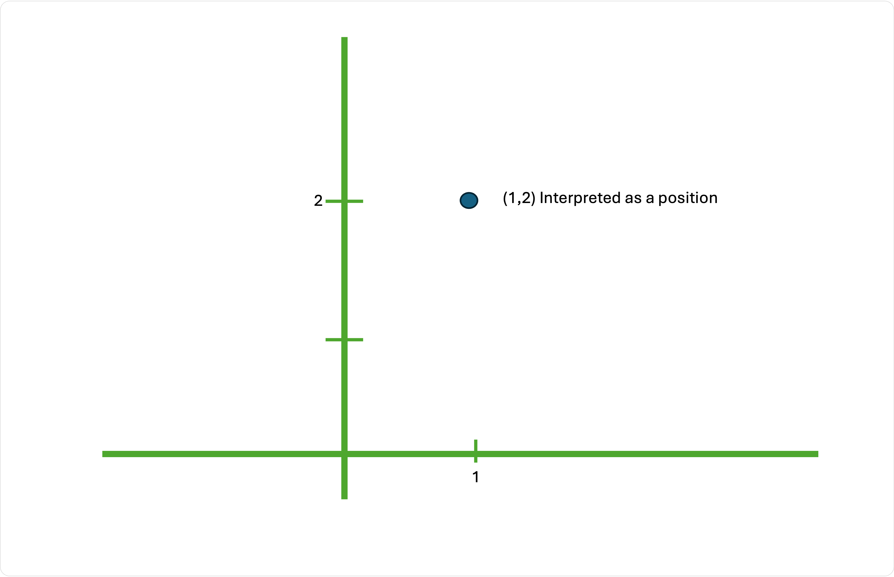
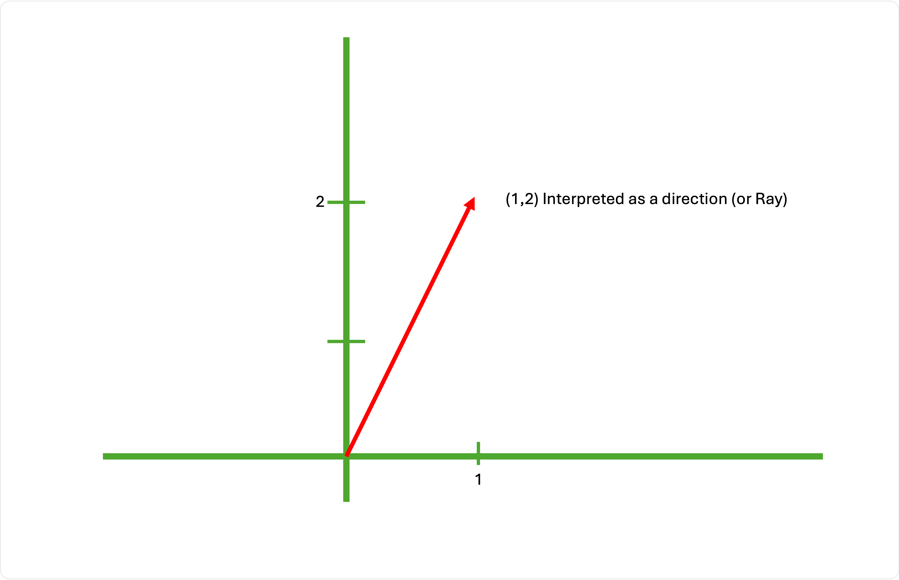
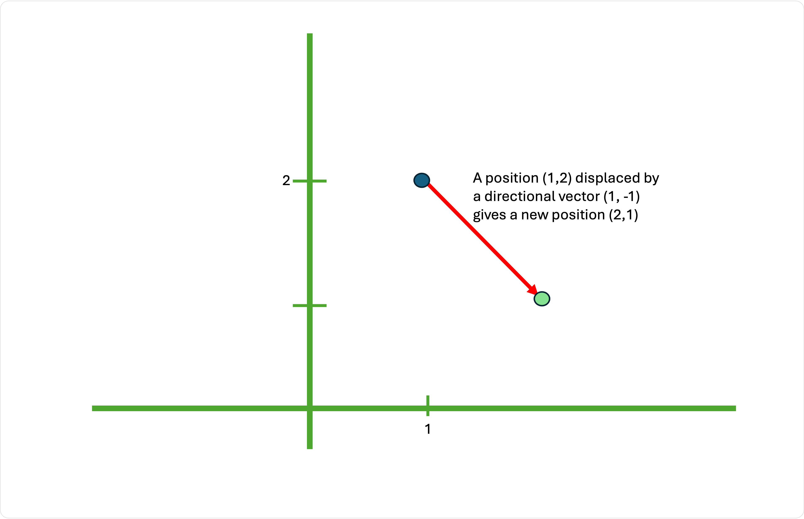
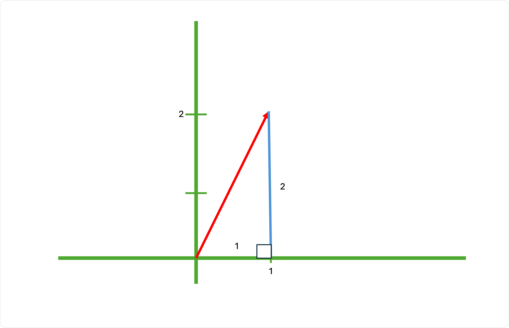
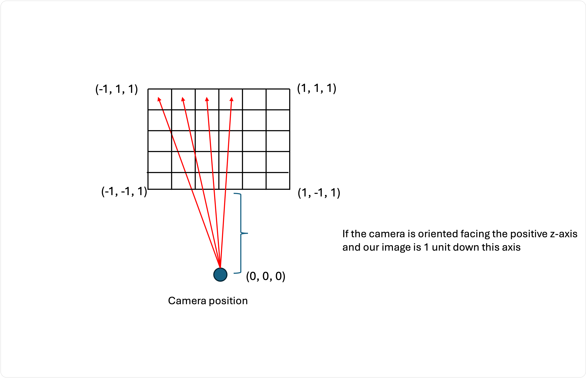

# Mathématiques vectorielles

Nous avons besoin d'un moyen de représenter les rayons et les positions dans notre monde en 3D.

## Positions

Nous savons qu'une position en deux dimensions peut être représentée par la position horizontale `x` et la position verticale `y` sous une forme vectorielle simple :

```
(x, y)
```

Ainsi, un point situé à 2 unités vers la droite et à 1 unité vers le haut serait :

```
(2, 1)
```

Nous pouvons simplement ajouter une dimension ou une troisième valeur à notre vecteur pour représenter la profondeur :

```
(x, y, z)
```

Si le point ci-dessus se trouve en réalité à 3 mètres (3 unités sur l'axe z) :

```
(2, 1, 3)
```


## Directions

Une direction peut également être représentée à l'aide d'un vecteur 3D. Imaginons que nous nous trouvions à l'origine et que nous regardions directement vers l'axe des x positifs. Cette direction peut être représentée comme suit :

```
(1, 0, 0)
```

Ou si la personne regarde l'axe z positif :

```
(0, 0, 1)
```

Vous êtes peut-être un peu perdu. Quelle est la différence entre une position et une direction ? 

Tout dépend de la façon dont nous interprétons notre vecteur.


Considérons le vecteur `(1, 2)`. Nous pourrions l'interpréter comme un point dans l'espace 3D (une position) :



Nous dirons également que ce même vecteur représente une direction qui commence à `(0, 0)` :




Ils ont exactement la même forme, mais des significations très différentes !


En fait, une **position** dans notre monde virtuel peut également être considérée comme le déplacement nécessaire pour arriver à la destination si nous sommes partis de l'origine `(0,0,0)`. 


Un vecteur directionnel peut être considéré comme le déplacement nécessaire pour aller d'une position A à une position B. Il présente deux caractéristiques :

- une direction
- une grandeur (longueur)

Imaginez que nous soyons au point `(1, 1)` et que nous devions nous rendre au point `(4,5)`. Nous pourrions nous déplacer de 3 unités vers la droite et de 4 unités vers le haut. Notre déplacement final peut donc être exprimé par un vecteur `(3, 4)`. Mais nous n'avons pas besoin de nous déplacer vers la droite et vers le haut, nous pouvons simplement marcher tout droit jusqu'à notre destination. Il s'avère que la longueur de notre trajectoire est de 5 unités !

Nous sommes donc partis du point `(1, 1)`, nous avons suivi le déplacement `(3,4)` et nous arrivons à notre destination `(4,5)` :

```
(1, 1) + (3, 4) = (4, 5)
```

Pouvez-vous comprendre pourquoi j'ai dit que nous avons déplacé 5 unités ?

## Addition

L'addition de vecteurs est vraiment intéressante car un simple `+` entre un point et une direction nous donne un nouveau point :

```
Point (1, 2) + Direction (1, -1) = New Point (2, 1)
```



Ou plus simplement :

```
(1, 2) + (1, -1) = (2, 1)
```

Ainsi, l'interprétation géométrique de l'ajout d'un vecteur position à un vecteur direction consiste à se déplacer du point vers une destination finale, en suivant le déplacement exprimé par le vecteur direction.

Qu'en est-il de l'ajout de vecteurs directionnels ? C'est l'équivalent de l'ajout d'un point de repère à notre voyage. Le vecteur résultant exprime le déplacement final de la première position à la destination, et sa longueur est le chemin le plus court entre ces deux points.

## Soustraction

Je suis au point A et je dois me rendre au point B ? Quel est le déplacement nécessaire ?

Cela se calcule facilement en effectuant une soustraction !

Prenez le point de destination (B) et soustrayez le point de départ (A). Le résultat est un vecteur directionnel qui vous permet d'aller du point A au point B.

```
Start: (1, 1)
End: (4, 5)

Displacement = End - Start
             = (4, 5) - (1, 1)
             = (3, 4)
```


## Un rayon

Qu'est-ce qu'un rayon ?

Comme pour un rayon lumineux, il y a une source (son origine) et la direction dans laquelle la lumière va se déplacer. La lumière se déplacera dans cette direction à l'infini ! 

Nous exprimons donc notre rayon à l'aide de 2 valeurs : 


- `o` : une origine (une position)
- `d` : une direction **normalisée**, c'est-à-dire avec une longueur de un, qui représente la direction de la ligne sans spécifier sa longueur (parce qu'elle est infinie !)

Nous pouvons obtenir n'importe quel point sur ce rayon en spécifiant la longueur du rayon à parcourir, à partir du point d'origine. Rappelez-vous que la longueur de notre vecteur de direction est de 1, donc si nous le multiplions par n'importe quelle valeur, il s'étirera jusqu'à cette valeur (exemple `1 * 5 = 5`).

```
// We want to travel t units in the direction of our ray
ray = o + (t * d)

// Example
o = (1, 1)
d = (0, 1)
t = 5

point on ray = (1, 1) + (5 * (0, 1))  
             = (1, 1) + (0, 5)
             = (1, 6)
```


## Normalisation d'un vecteur directionnel

Nos mathématiques vectorielles seront plus faciles si la partie directionnelle de notre rayon a une longueur de 1. Comment forcer le vecteur directionnel à 1 ? Eh bien, nous divisons par sa longueur !

Par exemple, si un vecteur a une longueur de 5, nous savons que `5 / 5 = 1`. Il nous suffit donc de diviser chaque composante de notre vecteur de direction par 5.


Mais comment obtenir la longueur d'un vecteur ? Pythagore !




Tout vecteur de direction peut être exprimé sous la forme d'un triangle rectangle par rapport aux axes du monde. La longueur de ce triangle est donc de :

$$
h^2 = x^2 + y^2
$$

Or:
$$
h = \sqrt{x^2 + y^2}
$$

Nous pouvons donc normaliser le vecteur en le divisant par `h` :

```
d = (1, 2, 3)
length = sqrt(1*1 + 2*2 + 3*3)
dNormalized = (1 / length, 2 / length, 3 / length)

```


## Ray tracing

Revenons à notre traceur de rayons. Pour simplifier nos calculs, plaçons la caméra à l'origine `(0, 0, 0)`. 

Disons que nous voulons projeter la scène sur un plan carré situé à 1 unité de l'axe z de la caméra :




Nous allons donc faire passer un rayon par chaque pixel :

```
ray00 = { o: (0, 0, 0), d: normalize(-1, 1, 1) }
ray01 = { o: (0, 0, 0), d: normalize(-0.666, 1, 1) }
ray02 = { o: (0, 0, 0), d: normalize(-0.333, 1, 1) }
...
ray10 = { o: (0, 0, 0), d: normalize(-1, 0.666, 1) }
ray11 = { o: (0, 0, 0), d: normalize(-1, 0.333, 1) }
...
```



Que se passe-t-il si la caméra n'est pas à l'origine ? Que se passe-t-il si la caméra n'est pas orientée vers l'axe z positif ? 

Pouvez-vous trouver la solution mathématique pour que la série de rayons soit toujours projetée ?
